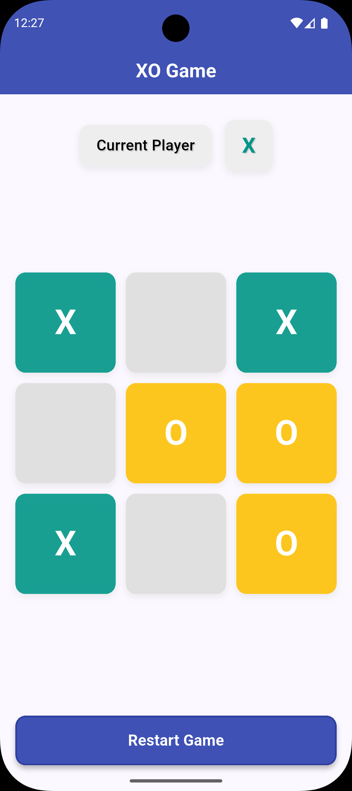
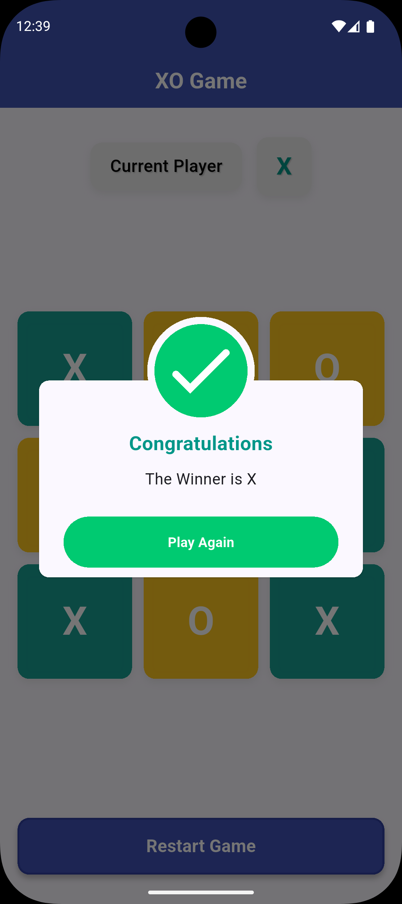
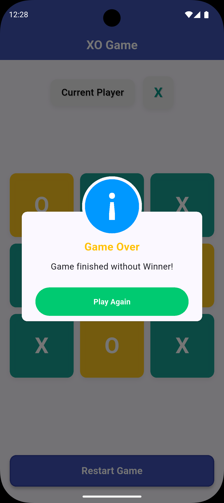

# Tic Tac Toe Game (X-O Game)

A beautiful and interactive Tic Tac Toe game built with Flutter and GetX state management. This classic two-player game brings the traditional X and O experience to your mobile device with a modern, clean UI.

## 🎮 Features

- **Classic Gameplay**: Traditional 3x3 Tic Tac Toe board
- **Two Players**: Perfect for playing with friends
- **Turn Indicator**: Clear indication of whose turn it is
- **Win Detection**: Automatic detection of winning combinations
- **Draw Detection**: Recognizes when the game ends in a draw
- **Restart Option**: Quick restart button to play again
- **Responsive Design**: Works on various screen sizes
- **Modern UI**: Clean and intuitive interface with Material Design 3

## 🛠️ Tech Stack

- **Framework**: Flutter (Dart)
- **State Management**: GetX
- **Architecture**: Modular structure with separation of concerns
- **UI Components**: Custom widgets for player info, game board, and controls

## 📁 Project Structure

```
lib/
├── business_logic/
│   └── game_controller.dart    # Game logic and state management
├── modules/
│   ├── screens/
│   │   └── home_screen.dart    # Main game screen
│   └── widgets/
│       ├── player_info_widget.dart
│       ├── game_board_widget.dart
│       └── restart_button_widget.dart
└── themes/
    └── app_theme.dart          # Custom app styling
```

## 🚀 Getting Started

### Prerequisites

- Flutter SDK (3.9.2 or higher)
- Dart SDK (bundled with Flutter)
- Android Studio or VS Code with Flutter plugin

### Installation

1. Clone or download the project
2. Navigate to the project directory
3. Install dependencies:
   ```bash
   flutter pub get
   ```
4. Run the app:
   ```bash
   flutter run
   ```

### Building for Production

To build the app for release:

```bash
flutter build apk --release
```

Or for iOS:

```bash
flutter build ios --release
```

## 🎯 How to Play

1. Player X goes first
2. Players alternate placing X and O marks on the grid
3. The first player to get 3 of their marks in a row (up, down, across, or diagonally) wins
4. When all 9 squares are full, the game is over. If no player has 3 marks in a row, the game ends in a draw

## 🧩 Game Logic

The game controller handles:
- Turn management between players X and O
- Validating moves (checking if a cell is empty)
- Detecting winning combinations (8 possible ways to win)
- Tracking game state (ongoing, win, or draw)
- Resetting the game state

## 🎨 UI Components

- **Player Info Widget**: Shows current player and game status
- **Game Board Widget**: Interactive 3x3 grid for placing marks
- **Restart Button Widget**: Allows starting a new game anytime

## 🤝 Contributing

Contributions are welcome! Feel free to fork this repository and submit pull requests for improvements.

### Possible Enhancements

- Add difficulty levels for AI opponent
- Implement sound effects
- Add animations for moves and wins
- Include score tracking
- Add themes/dark mode support

## 📷 Screenshots

<div align="center">
  
  
  
</div>


## 📜 License

This project is open source and available

## 📞 Contact

If you have any questions or suggestions, feel free to reach out!
